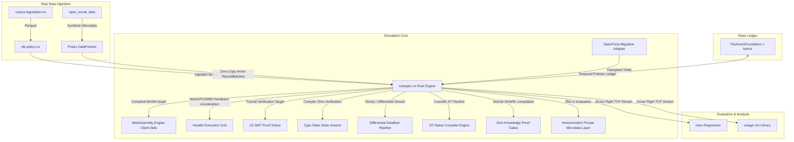
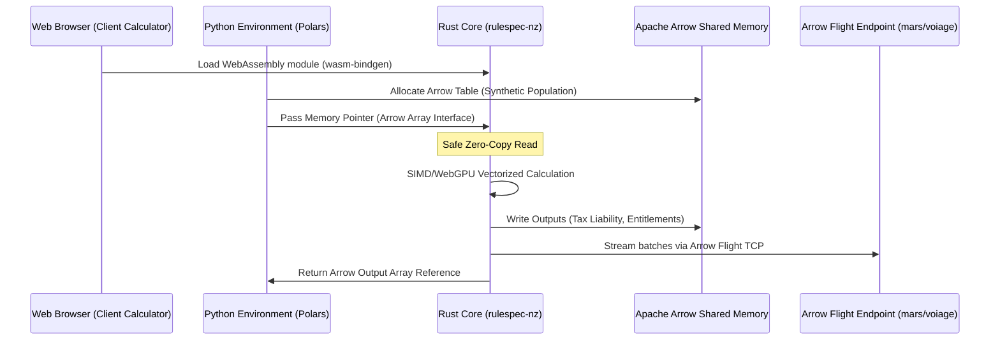

# System Requirements (MoSCoW) & Architecture Design

This document details the requirements and the system design for the NZ Rules-as-Code (RaC) simulation pipeline.

---

## 1. Requirements (MoSCoW)

### Must Have
*   **Rust-based Core & PyO3 Bindings:** High-performance evaluation core exposed to Python.
*   **Zero-Copy Memory Layout:** Integration of Apache Arrow/Polars for processing microdata without copying overhead.
*   **NZ Statutory Ingestion:** Adapt to local Parquet data layers parsed from `corpus-legislation-nz` and `corpus-nz-hansard`.
*   **YAML RuleSpec Validation:** Parse and compile the NZ RuleSpec schemas (`statutes`, `regulations`, `policies`).
*   **Strict Rust Quality Gates:** Comprehensive formatting (`rustfmt`) and strict linting constraints (`clippy --deny warnings`) in the local/CI loop.

### Should Have
*   **WASM Compilation Target:** Compile the core `rulespec-nz` logic to WebAssembly via `wasm-bindgen` for high-performance client-side browser evaluation.
*   **Arrow Flight Data Ingestion:** Use Apache Arrow Flight TCP streams for low-latency, parallel transfers of micro-simulation data between execution pipelines.
*   **Type-State Compile-Time Verification:** Enforce legislative states and calculations via Rust type-state pattern to catch invalid policy paths at compile-time.
*   **Cranelift JIT Compilation Engine:** JIT-compile RuleSpec files to native machine code at runtime using Cranelift to eliminate evaluation loop overhead.
*   **OpenFisca Migration Adapter:** Automatic parsing utility to map legacy `openfisca-aotearoa` Python code to RuleSpec YAML.
*   **Microsimulation Data Pipe:** Interface to inject synthetic populations from `open_social_data`.
*   **Value of Information Routing:** Link outputs to the `mars` regression and `voiage` VoI libraries.

### Could Have
*   **Fully Homomorphic Encryption (FHE):** Run simulations on encrypted administrative population microdata using `tfhe-rs` without exposing raw records.
*   **Zero-Knowledge Proof (ZKP) Targets:** Compile rules to zk-SNARK constraint systems using `arkworks` or Noir for private eligibility assertions.
*   **Differential Dataflow Calculations:** Low-latency incremental engine evaluations using `differential-dataflow` to re-compute only affected population nodes.
*   **Formal Proof Solvers:** Compile RuleSpec equations into SMT-LIB2 structures for formal proof verification via Z3 Solver.
*   **Distributed Ray-on-Arrow Grid:** Scale simulations horizontally using a distributed cluster architecture.
*   **WebGPU/SIMD Vectorized Acceleration:** Massively parallel GPU/SIMD execution (via `wgpu-rs`) for country-scale synthetic populations.
*   **Automated Source-Spec Auditing:** Automated CI validation layers matching compiled rules to parsed legislative text in `corpus-legislation-nz` using semantic checking.
*   **Scraped Admin Ingestion:** Integration with `fyi-cli` metadata.
*   **Temporal Ledger Management:** Policy state lifecycle tracking using `kairos` and `TheAxiomFoundation`.

### Won't Have (for this phase)
*   Real-time public API web service deployment.

---

## 2. System Architecture Design

### Zero-Copy Arrow & Flight Integration Flow

